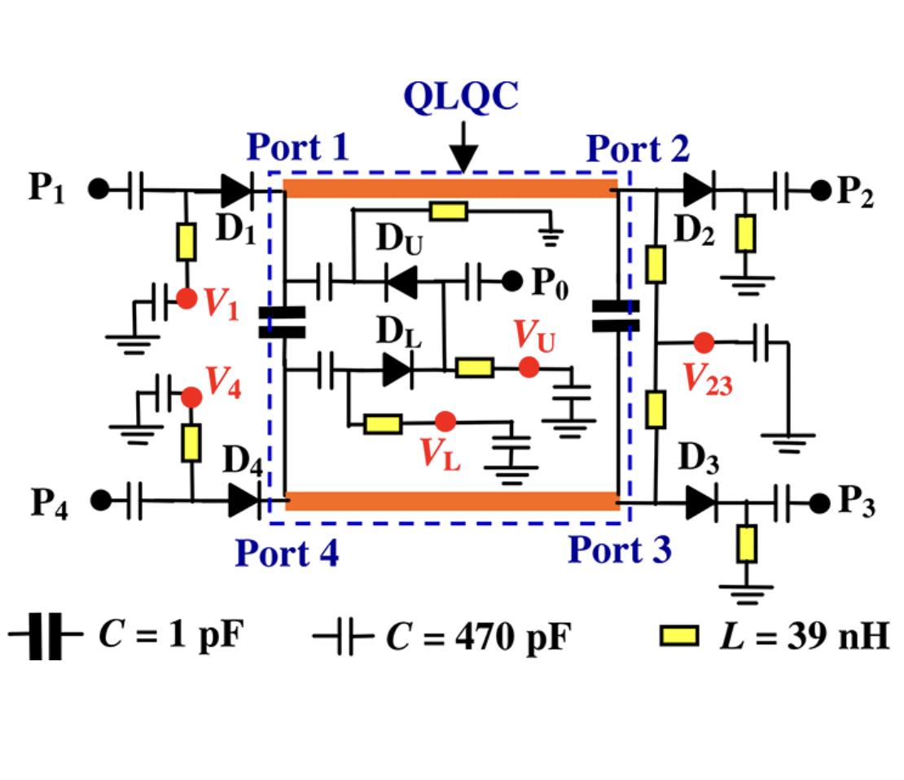

# High-Frequency Circuits for Systems-on-Chip
# Feeding Network per Array di Antenne
  - ✅ Definisci il modello circuitale equivalente
  - ✅ Modella ciascun ramo come linea di trasmissione microstrip con impedenza caratteristica Z0.
  - ✅ Inserisci divisori di potenza e coupler (ad esempio Wilkinson) per generare le vie dell’array.
  - ✅ Modella i PIN diodi come commutatori:
    - ON = resistenza bassa (circuito chiuso)
    - OFF = capacità/parassitica (circuito aperto)
   
  - ✅ Costruzione del network in Qucs
    - Usa componenti microstrip line o TL per i rami principali.
    - Inserisci condensatori di blocco DC e resistori di bias virtuali per simulare la polarizzazione dei diodi.
    - Collega le uscite ai porti di antenna (punti di simulazione).
     
  - ✅ Simulazione dei parametri S
  - ✅ Esegui analisi AC Sweep o S-parameters per tutte le configurazioni dei diodi.
  - ✅ Controlla:
    - S11: matching all’ingresso
    - S21…S2N: distribuzione di potenza tra le vie
    - Fase relativa tra le uscite
   
  - ✅Analisi delle configurazioni dinamiche

    - Simula più stati di commutazione dei diodi per vedere come cambia la distribuzione di potenza e fase verso le antenne.
    - Valuta perdite e isolamento tra rami.
     
  - ✅ Ottimizzazione

  - ✅ Modifica le lunghezze delle linee o le impedenze nel modello microstrip per ottimizzare:
    - Inserzione minima (basse perdite)
    - Isolamento massimo tra vie
    - Fase desiderata per beamforming

## DESIGN DEL CIRCUITO CON SCHEMATICA

*Figura 1: Schema elettrico delL'antenna riconfigurabile progettato su QUCS.*
### 📂 File di Simulazione
I file sorgente per la simulazione su QUCS sono disponibili qui:
* [Schema del Progetto (.sch)](./file%20si%20simulazione/HFC_Project.sch)
* [Dati di simulazione (.dat)](./file%20si%20simulazione/HFC_Project.dat)
---
### 📄 Documentazione Finale
Per un'analisi dettagliata dei risultati e della metodologia, consulta il [Report Tecnico (PDF)](./Written_Report_HFC.pdf).
